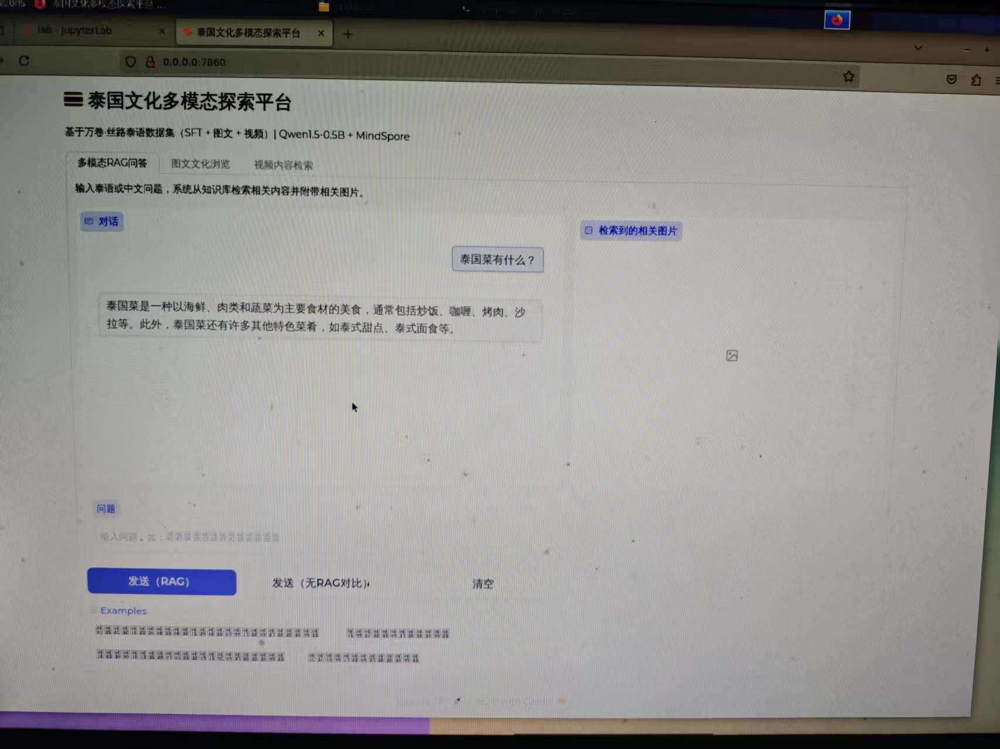
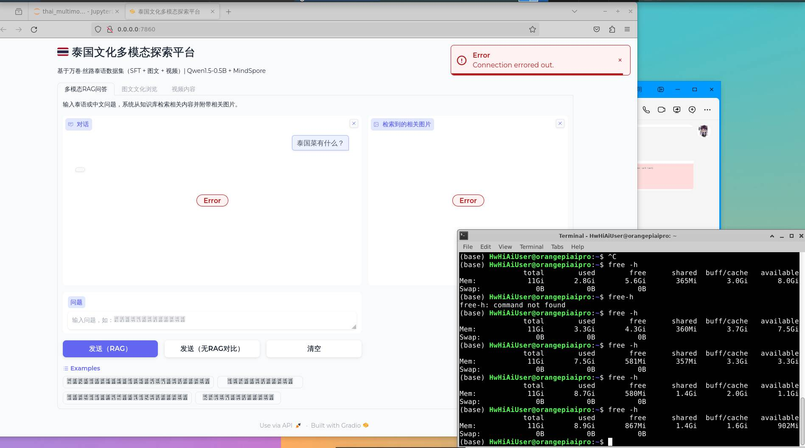
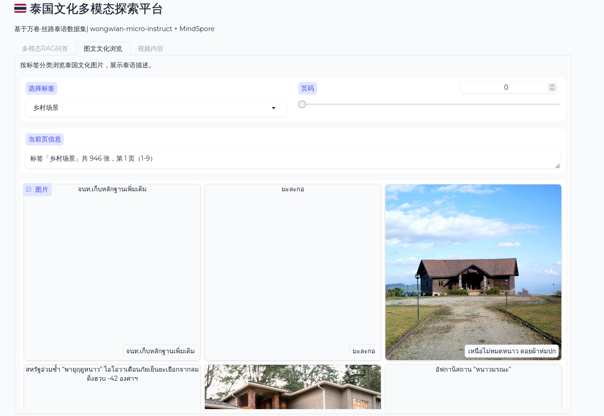
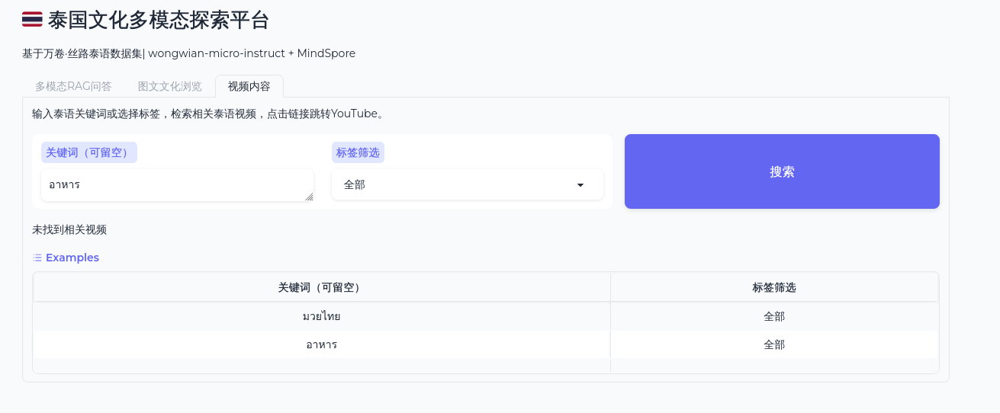
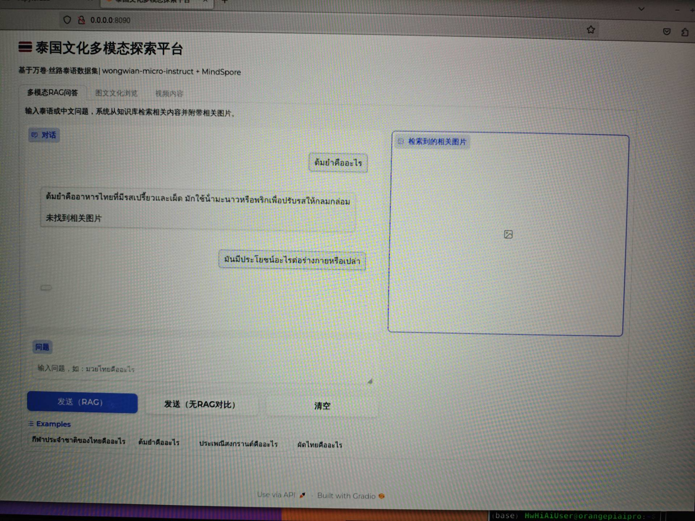
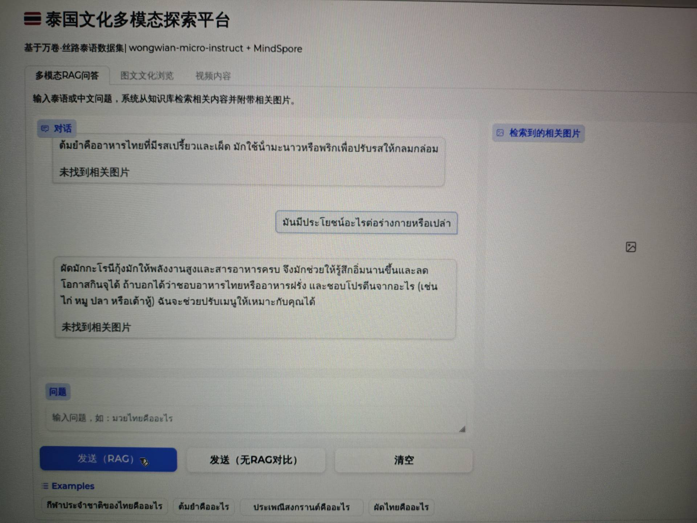
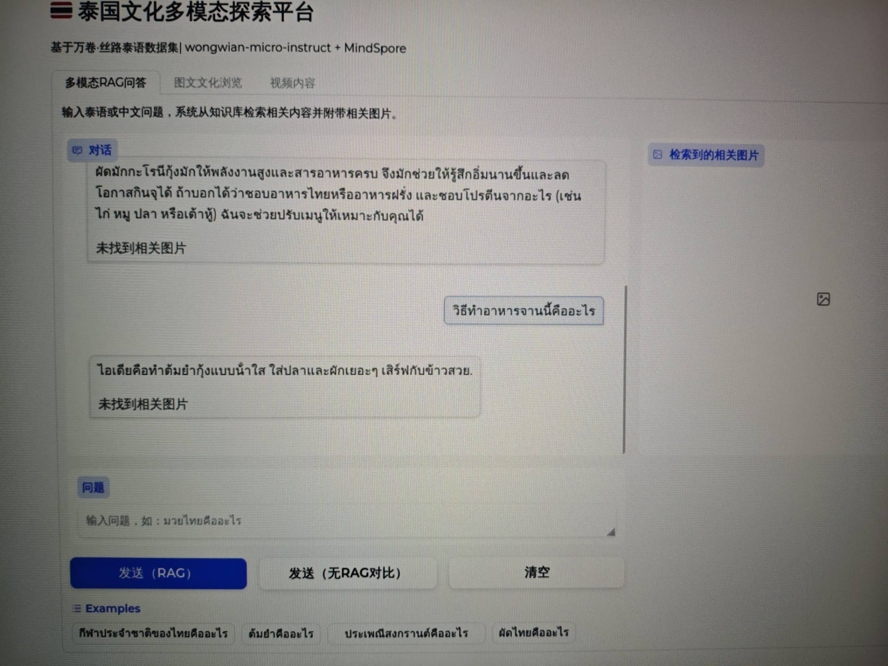
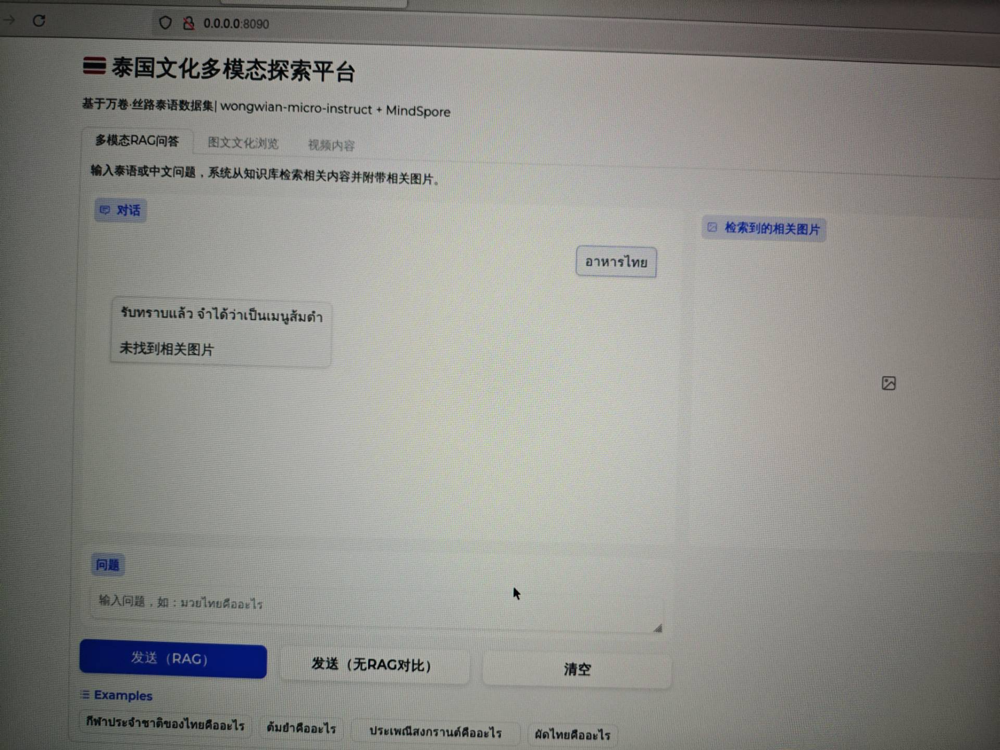
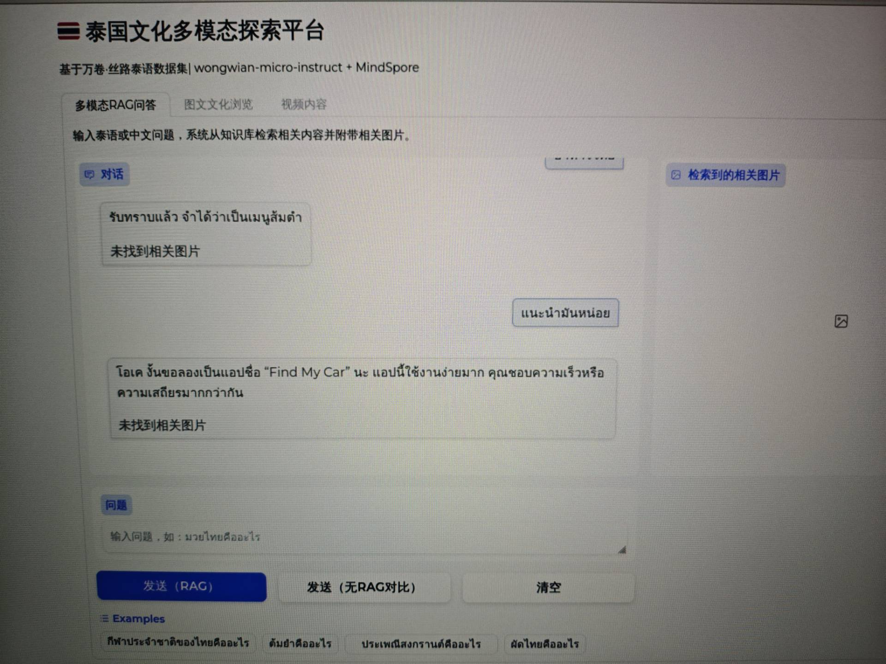
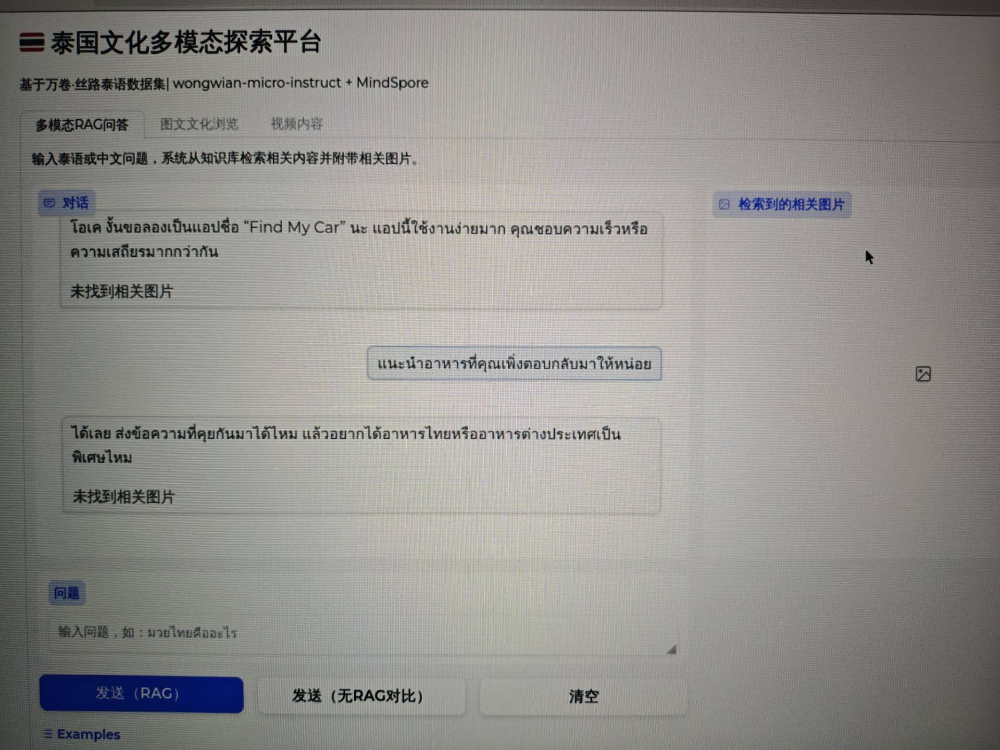

# 泰国文化多模态探索平台

基于昇思MindSpore框架和wongwian-micro-instruct模型实现的泰语多模态RAG问答系统

## 介绍

基于香橙派AIpro，利用「万卷·丝路」泰语多模态数据集，构建一个支持RAG问答、图文文化浏览和视频内容检索的多模态探索平台。

### 环境准备

开发者拿到香橙派开发板后，首先需要进行硬件资源确认，镜像烧录及CANN和MindSpore版本的升级，才可运行该案例，具体如下：

开发板：香橙派AIpro或其他同硬件开发板  
开发板镜像：Ubuntu镜像  
`CANN Toolkit/Kernels：8.1RC1`  
`MindSpore：2.5.0`  
`MindNLP：0.4.1`  
`Python：3.9`

#### 镜像烧录

运行该案例需要烧录香橙派官网ubuntu镜像，烧录流程参考[昇思MindSpore官网--香橙派开发专区--环境搭建指南--镜像烧录](https://www.mindspore.cn/tutorials/zh-CN/r2.7.0rc1/orange_pi/environment_setup.html)章节。

#### CANN升级

CANN升级参考[昇思MindSpore官网--香橙派开发专区--环境搭建指南--CANN升级](https://www.mindspore.cn/tutorials/zh-CN/r2.7.0rc1/orange_pi/environment_setup.html)章节。

#### MindSpore升级

MindSpore升级参考[昇思MindSpore官网--香橙派开发专区--环境搭建指南--MindSpore升级](https://www.mindspore.cn/tutorials/zh-CN/r2.7.0rc1/orange_pi/environment_setup.html)章节。

### 核心库版本

```
Python       == 3.9
MindSpore    == 2.5.0
mindnlp      == 0.4.1
gradio       == 4.44.0
scikit-learn == 1.4.0
```

## 快速使用

建议下载 wongwian-micro-instruct 模型至本地路径（如 /home/HwHiAiUser）：

```
git lfs install
git clone https://huggingface.co/wongwian/wongwian-micro-instruct
```

在 ipynb 文件中根据模型路径修改对应 step 中的模型路径，然后逐步运行即可。

## 1、使用模型

**wongwian-micro-instruct**：泰国的小模型，作为问题时输入需要泰语，输入中文时只会当作二进制进行处理无法正确回答

使用Qwen1.5模型运行时仅成功运行过一次（picture/0_1.jpg），可以中文输入，中文输出，其他大部分由于内存不足卡死（picture/0_2.jpg）。





## 2、界面效果

主要分为三个部分，如下图（picture/1.png）所示，分为多模态RAG回答、图文文化浏览、视频内容三个模块。

图文浏览主要就是筛选不同标签的图片进行展示，但由于部分图片链接是外网链接，香橙派无法访问到外网，所以图上有部分未显示出来；视频内容图像展示如下图（picture/2.png）。





由于香橙派内存一共仅12G，在进行数据集的加载及模型加载之后内存仅剩800多MB，所以后续没有记载相关视频。但第一版的代码可以加载视频，加载后效果是输入关键字，模型会筛选出相关视频的链接，在电脑本机上可以访问到外网YouTube视频。

## 3、模型问答

主要分为RAG问答和非RAG问答，RAG是检索增强生成，传统AI生成内容只依赖于其在大模型预训练阶段学习到的知识，而RAG在回答之前会先进行检索，对应于本项目：

首先用户输入问题，然后系统会在后台匹配相关的泰文的图文并且结合上下文，再在对话框返回回答给用户。总的来说就是它会结合用户的历史问题进行回答。

以下就是进行了RAG回答和非RAG回答的结果对比图：

### RAG回答

问：ต้มยำคืออะไร（冬阴功是什么？）

答：ต้มยำคืออาหารไทยที่มีรสเปรี้ยวและเผ็ด มักใช้น้ำมะนาวหรือพริกเพื่อปรับรสให้กลมกล่อม（冬阴功是泰国的一道酸辣风味菜肴，通常会用青柠汁或辣椒来调和风味，让口感更平衡柔和。）如图（picture/3.jpg）



继续问：มันมีประโยชน์อะไรต่อร่างกายหรือเปล่า（它对身体有什么好处吗？）

回答：ผัดมักกะโรนีกุ้งมักให้พลังงานสูงและสารอาหารครบ...（冬阴功通常能提供较高的能量和全面的营养，有助于增强饱腹感、减少零食摄入。）如图（picture/4.jpg）



继续问：วิธีทำอาหารจานนี้คืออะไร（这道菜的做法是什么？）

答：ไอเดียคือทำต้มยำกุ้งแบบน้ำใส ใส่ปลาและผักเยอะๆ เสิร์ฟกับข้าวสวย.（建议的做法是做清汤冬阴功虾，放入鱼和大量蔬菜，搭配白米饭食用。）（picture/5.jpg）



**以上就是RAG回答：模型会根据用户所提过的问题进行检索并返回回答**

### 非RAG回答

选择非RAG回答时，系统不用根据用户所提过的问题进行回答，因此回答时会牛头不对马嘴

例如（picture/6.jpg）：

问：อาหารไทย（泰国菜 / 泰国料理）

答：รับทราบแล้ว จำได้ว่าเป็นเมนูส้มตำ（收到了，我记下来这道菜是青木瓜沙拉（宋丹）。）



当继续问：แนะนำมันหน่อย（介绍一下它吧）

答：โอเค งั้นขอลองเป็นแอปชื่อ "Find My Car" นะ...（好的，那我们来试试 "Find My Car" 这个应用吧。）—— 回答的根本不是所提问题，答非所问（picture/7.jpg）



继续问：แนะนำอาหารที่คุณเพิ่งตอบกลับมาให้หน่อย（介绍一下你刚刚回答的那道菜吧。）

答：ได้เลย ส่งข้อความที่คุยกันมาได้ไหม...（可以的，你把我们之前的聊天记录发给我一下可以吗？）—— 并未回答上文的问题（picture/8.jpg）



## 预期输出

模型根据泰语多模态数据集进行RAG检索问答，RAG模式下结合历史上下文返回相关回答并附带图片链接；非RAG模式下直接生成回答，不参考历史记录，减少幻觉产生。

以上就是全部运行结果，对于图片显示，由于内存原因，所以在前期数据的加载对图片进行大部分消减，仅有3000条，因此只有问到特定的词才能找到相关图片，并显示图片链接，可在电脑本机访问外网。
